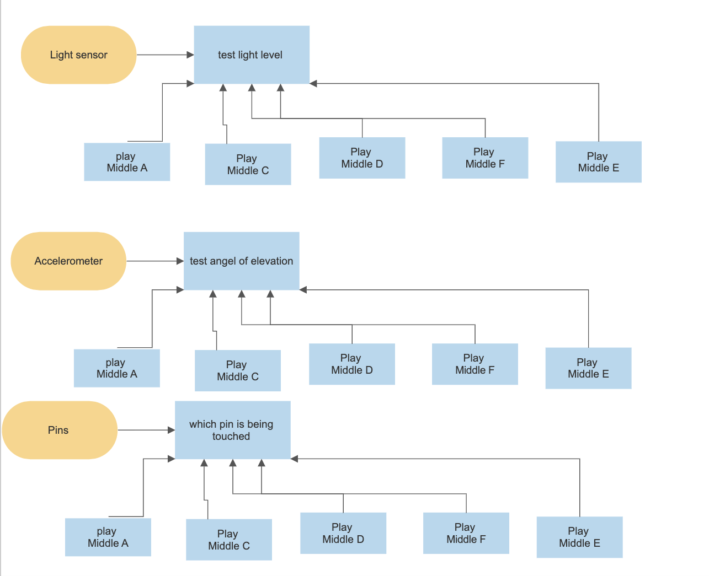

# Assessment 1: Replication project
Saxaphone

*Markdown reference:* [https://guides.github.com/features/mastering-markdown/](http://guides.github.com/features/mastering-markdown/)

## Replication project choice ##
(Insert the name of the project you chose to replicate.)

## Related projects ##
*Find about 6 related projects to the project you choose. A project might be related through  function, technology, materials, fabrication, concept, or code. Don't forget to place an image of the related project in the* `replicationproject` *folder and insert the filename in the appropriate places below. Copy the markdown block of code below for each project you are showing, updating the number* `1` *in the subtitle for each.*

### Related project 1 ###
(Artiphon INSTRUMENT 1)

(https://artiphon.com/products/instrument-1?variant=16105333522466)

This is releeated to my project beacuse, it is using different actions to manipulate sound.

### Related project 2 ###
(Reactable)

(https://reactable.com/)

This project is related to mine because, simmilarly to the prevouse one it is using different actions to manipulate sound. This one also includes elements that allow it to be more toy like.

### Related project 3 ###
(Seaboard RISE)

(https://roli.com/products/seaboard/rise-49)

This project also allow to to manliplate sound with interactions. This poject also allows to record sound, this could be i could extent my project.

### Related project 4 ###
(AlphaSphere)

(https://alphasphere.com/)

This project also allow to to manliplate sound with action but in a really unusual way. The ball shape creates many ways to interect with it. It has be designed to the user will learn new and interesting ways to use the project. This could be somthing for me to incoperate in my project. It also has IPhone connectivity, that could be a further way to extend mt project.

### Related project 5 ###
(Jambé)

(http://getjambe.com/)

This project is a drum vertion of my project.The Jambé is a multi-faceted pad that is capable of reproducing several unique percussion sounds. 

### Related project 6 ###
(ROLI Songmaker kit)

(hhttps://roli.com/products/blocks/songmaker-kit)

This project also allow to to manliplate sound with interactions. This poject also allows to record sound and has IPhone connectivity, this could be i could extent my project. this project shows how i could develop my project designed as a childerens toy coud be developed and created to adult usses.

## Reading reflections ##
*Reflective reading is an important part of actually making your reading worthwhile. Don't just read the words to understand what they say: read to see how the ideas in the text fit with and potentially change your existing knowledge and maybe even conceptual frameworks. We assume you can basically figure out what the readings mean, but the more important process is to understand how that changes what you think, particularly in the context of your project.*

*For each of the assigned readings, answer the questions below.*

### Reading: Don Norman, The Design of Everyday Things, Chapter 1 (The Psychopathology of Everyday Things) ###

Before this reading I had no idea what affordances were. This reading helped me to understand what affordances are and brought to my attention the amount of thought that goes into simple things. The reading helped me see simple design elements can have a huge impact on the overall design. For example, the sink that was talked about in the reading, although the action of pressing the cap of the drain is simple, people don’t think of that as a first instinct and also your clean hands have to touch the dirty water to turn drain the water. I can apply the ideas from this reading to my project. For example, I need to make sure my design is useable for everyone, and make sure that my first instinct on how to use it is the same as other people’s. I can do this by asking other people to use it without any instructions. I also need to look into the affordances my project supplies. A question I have from the reading is what can be changed to make affordances easier to understand?         

### Reading: Chapter 1 of Dan Saffer, Microinteractions: Designing with Details, Chapter 1 ###

Before this reading I believed that micro interactions did not hugely affect an overall product/ application. This reading has brought the impotence of micro interactions to my attention.  Now I can see how much of a difference micro interaction makes. I can also now see how much I use micro interactions in a day without even knowing and I can incorporate this into my project. Having good micro interaction can improve my overall useability. One question I have after this reading is what would happen if some of the micro interactions were changed, for example, if toasters did multiple things, not just toast. Would this affect the toaster in a positive or negative way? Would it increase useability or not?       

### Reading: Scott Sullivan, Prototyping Interactive Objects ###

Before this reading I was not clear on the difference between designer and developer. Now I know that the designer makes make nontechnical decisions whereas the developer implements those decisions. This reading also helped me see the importance of prototyping and how it can help to reveal any issues. This can be used in my project. One question I have after this reading was are there different ways of creating prototypes?  

## Interaction flowchart ##

## Process documentation

First, I made a template which was a simple outline of a saxophone. the oroginal project was a gutar i decided to change it to a saxaphone. Then I traced it twice onto a piece of cardboard and it out with a box cutter. The thickness of the cardboard made it difficult to cut and I ended up going over both sides with the box cutter. 

Then, I glued the two pieces together with a glue stick and cut off the excess.I did this to make the body stronger and more substantial.

Next, I covered the edges with paper. I did this by cutting pieces of paper and gluing them around the edges of the cardboard using craft glue. Then, I added a piece of paper to the top and bottom to make it look neater and smoother. 

I then painted it gold and let it dry overnight.I did this to make it look more like a Saxphone and to make it look like a finished project.

When it had dried, I connected the micro bit to my computer and put in the block code above. I connected the battery pack to the micro pit and attached a crocodile clip to 0 pin and the other end to the tip of an earphone jack. Then I connected another crocodile clip from the ground pin to the base of the headphone jack, placed it where I wanted it to go and taped in down. I used double sided tape on the battery pack and the micro bit and I used masking tape on the other side.

Following the tutorial, I the put this code in and then a pressed the A button and moves the saxophone it played a note the note played is based on the angle I held the saxophone and the amount of light on the micro bit changed that was played. Also touching a pin changes the not too.

This is the final code - when the A button is pressed the it plays a note. You can manipulate the note that is played by changing the angle you hold the saxophone or covering the micro bit or touching the pins.

*Include screenshots of the code you have used.*

## Project outcome ##

*Complete the following information.*

### Project title ###
* Saxaphone *

### Project description ###

*My Project is based of the micro bit Guitar project but has been adapted to be a saxophone. The Saxophone has been designed to play different notes depending on the angle the saxophone is held at, the amount of light the micro bit and if the user is touching a pin. I have designed this to be a children’s toy as it is simple but can provide a lot of entertainment for a child.*

### Showcase image ###

*Try to capture the image as if it were in a portfolio, sales material, or project proposal. The project isn't likely to be something that finished, but practice making images that capture the project in that style.*

### Additional view ###

This is my project being used as an instument to practice playing music isnsted of a kids toy. It would be useful for highschool students.

### Reflection ###

I am happy with the way my project turned out. I was able to successfully turn the guitar project into a saxophone and get all the components working. I could have improved the look of the saxophone by hiding the wires and I also could have spent more time during the building of the saxophone to make things neater. I also could have changed the code to tailor it more to a saxophone. Also, my theory could have been developed more. 

Looking at the related projects really helped me to turn the guitar into a saxophone. It was also helpful to see projects similar to mine being done on an industry level. It allowed me to see how I could take my project further. The readings also helped me in the process of making the saxophone. It allowed me to look further than just making it. It helped me think about how this would actually be used, what kind of affordances it created and how to make sure it is useable for everyone. Also it made me look at more project in more detail, for example, I took notice of all the micro interaction. 

An interesting extension to the program might be using different speakers and maybe different sounds to make it more like a saxophone or making different instruments like a violin or Cheol and incorporating a bow. 

### video ###

